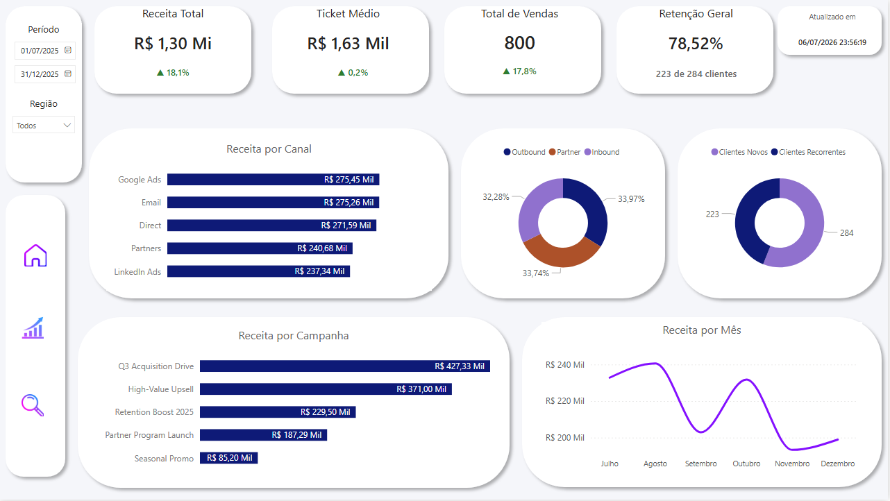
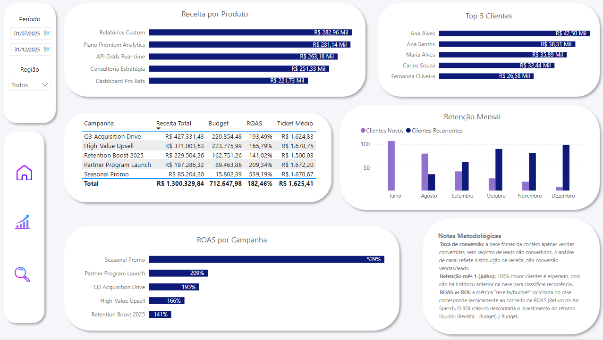

# Bet BI Analytics

*"Quantos leads viraram cliente?" É a primeira pergunta que qualquer gestor comercial faz. E a primeira lição deste case foi descobrir que, às vezes, a base de dados que você recebe simplesmente não permite responder isso e o trabalho de um analista de dados começa exatamente aí: em saber identificar essa lacuna, comunicá-la com clareza, e ainda assim extrair valor real do que existe.

Este repositório documenta o case técnico completo do CSV bruto ao dashboard final para uma vaga de Analista de Dados (Pleno), incluindo as decisões, os ajustes de rota e os motivos por trás de cada escolha.

> Dados fornecidos no escopo do processo seletivo; nomes de empresa e produtos são fictícios.

---

## O desafio

A empresa (fictícia, do setor de apostas esportivas) forneceu três arquivos `vendas.csv`, `clientes.csv`, `campanhas.csv`  cobrindo 6 meses de operação (jul–dez/2025), com uma pergunta central: **como está a saúde comercial do negócio, e onde estão as oportunidades?**

O enunciado pedia 5 respostas obrigatórias: faturamento e ticket médio, taxa de conversão por canal, top produtos/clientes, retenção de clientes, e ROI por campanha. Simples de enunciar. Nem tudo simples de entregar com integridade e é aí que a maior parte das decisões técnicas deste case aconteceu.

## A jornada: da ingestão ao insight

**1. Auditoria antes de confiar no dado.** Antes de qualquer gráfico, os 3 arquivos passaram por uma auditoria de qualidade no Databricks, checagem de nulos em campos críticos, duplicidade de chaves e integridade referencial entre vendas, clientes e campanhas. Resultado: base limpa, sem inconsistências estruturais. Isso deu segurança para seguir para a modelagem sem carregar problemas escondidos.

**2. A pergunta que a base não conseguia responder.** Ao chegar no KPI de "taxa de conversão por canal (vendas/leads)", ficou claro que a base só contém vendas já convertidas, não existe registro de leads que não viraram cliente. Em vez de forçar um número artificial, a decisão foi documentar essa limitação com transparência e substituir por uma métrica honesta: distribuição de receita por canal e origem de lead. É uma escolha que prioriza integridade analítica sobre "número bonito".

**3. Um erro de suposição temporal, corrigido a tempo.** As primeiras medidas de variação usavam comparação ano a ano (`SAMEPERIODLASTYEAR`) um reflexo automático de quem já trabalha com esse padrão. Só que a base cobre apenas 6 meses, um único ano. A correção: todas as medidas de variação foram refeitas para comparação mês a mês, o padrão certo para o formato real dos dados.

**4. ROAS, não ROI e por que isso importa.** O case pedia "ROI (receita/budget)" mas essa fórmula, tecnicamente, é a definição de **ROAS** (Return on Ad Spend), não de ROI (que descontaria o investimento do retorno líquido). A decisão foi manter a fórmula solicitada, só que com o nome tecnicamente correto, documentando a diferença no próprio dashboard. Pequeno detalhe, grande sinal de rigor conceitual.

**5. Uma métrica de retenção, dois contextos diferentes.** Um card de retenção geral (para leitura executiva, sem depender de nenhum filtro de mês) e uma visão detalhada mês a mês (para quem quer investigar a curva de maturação de clientes) porque a mesma pergunta ("os clientes voltam?") pede respostas diferentes dependendo de quem está olhando.

## O resultado

Um dashboard de 3 páginas;  Home, Executivo e Analítico. construído em Power BI com menu de navegação customizado, cards de KPI com variação automática, e mais de 20 medidas DAX.

### Executivo - leitura rápida para gestão


### Analítico - aprofundamento para quem quer investigar


## O que os dados revelaram

- **Receita bem diversificada entre canais** os 5 canais de venda têm receita muito próxima entre si (R$ 237 Mil a R$ 275 Mil). Nenhuma dependência perigosa de um canal só.
- **A campanha mais eficiente não é a de maior orçamento.** "Seasonal Promo" girou apenas R$ 15,8 Mil de budget e retornou R$ 85,2 Mil em receita ROAS de 539%, o maior de todas. Enquanto isso, a campanha de maior receita absoluta ("Q3 Acquisition Drive") tem ROAS de 193%. Escala e eficiência não caminham sempre juntas.
- **A retenção cresce de forma consistente ao longo do tempo** 78,52% dos clientes já compraram mais de uma vez. O primeiro mês da base começa, por definição, 100% "novo" (não há histórico anterior para comparar), e a proporção de recorrentes sobe mês a mês daí em diante, um sinal saudável de fidelização.
- **A aquisição está bem balanceada entre modelos** Inbound (32,3%), Outbound (34,0%) e Partner (33,7%) têm participação quase idêntica nas vendas.

Achados completos e recomendações de negócio em [`docs/GrowBet_BI_Documentacao_Case.docx`](docs/GrowBet_BI_Documentacao_Case.docx).

## Por trás da tela: o pipeline de dados

```
CSV (vendas, clientes, campanhas)
        │
        ▼
   🥉 BRONZE     →  ingestão bruta, sem transformação
        │
        ▼
   🔍 AUDITORIA  →  nulos, duplicidade, integridade referencial
        │
        ▼
   🥈 SILVER     →  padronização (TRIM, ROUND)
        │
        ▼
   🥇 GOLD       →  esquema estrela + dimensão calendário
        │
        ▼
   📤 EXPORT     →  CSV para consumo no Power BI
        │
        ▼
   📊 POWER BI   →  modelagem DAX + dashboard
```

Os CSVs Gold foram exportados (em vez de conexão direta ao Databricks) por uma razão prática: manter o case 100% reproduzível para quem for avaliar, sem depender de credenciais ou infraestrutura externa.

Documentação técnica completa (decisões de modelagem, resultado da auditoria) em [`docs/GrowBet_BI_Documentacao_Databricks.docx`](docs/GrowBet_BI_Documentacao_Databricks.docx).

## Estrutura do repositório

```
├── images/     Prints do dashboard (Home, Executivo, Analítico)
├── sql/        Notebooks Databricks (Bronze → Silver → Gold → Exportação)
└── docs/       Documentação de negócio e técnica
```

## Stack

`Databricks` · `PySpark` · `Spark SQL` · `Power BI` · `DAX`

---

Desenvolvido por **Jhonathan Panisson** — [GitHub](https://github.com/rjpanisson)
